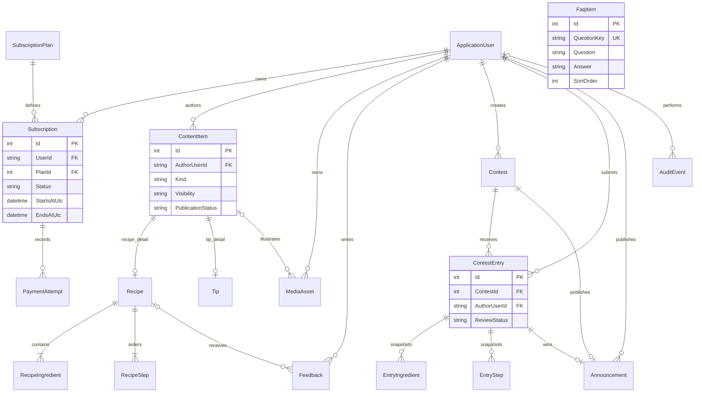

# JamesThew.com - System Design

## Proposed Design aur constraints

Is file ka full domain design **Proposed Design** hai. Scoped Phase 1 mein ApplicationUser(DisplayName), Identity DbContext/migration, roles/policies aur Account/Admin foundation implement hui; neeche business entities aur lifecycle future proposals hain. Required behavior [PRD](PRD.md) mein source-linked aur latest user overrides ke saath recorded hai: guests browse-only, contributions approval ke baad public, simulated/manual payments aur optional hosting. PDF p10 .Net aur SQL Server 2000 or later ko multiple software options ke saath list karta hai; ASP.NET Core MVC, EF Core ya Identity prescribe nahi karta. Hardware list Pentium 166+, 64MB+, Windows 98 or higher aur JVM ka legacy text hai; isey proposed modern stack ki verified runnable minimum requirements na samjhein. Faculty approval OD-05 zaroori hai.

Existing `JamesThew/JamesThew.csproj` `net10.0` target karta hai. Exact SDK, EF Core, SQL Server edition/version aur IDE final nahi. Local development/submission first hai; optional hosting selection required nahi. Phase 1 mein EF/Identity 10.0.12 aur SQL Server LocalDB foundation implement/verify hui. ApplicationUser.Bio, all subscription/payment/content/contest entities abhi nahi bani.

## Layers aur request flow

Browser -> MVC controller -> typed view model validation -> application service -> EF Core DbContext -> SQL Server. Razor views server-rendered pages dein; progressive JavaScript sirf interaction improve kare. Identity authentication/password/cookie management own kare. Authorization policy plus resource ownership service har write/read boundary par apply hon. Controllers query business rules repeat na karein. DemoPaymentService manual request/approval isolate kare; real gateway adapter/callback scope mein nahi; email provider future optional hai, configured hone ka claim nahi.

| Boundary | Zimmedari |
|---|---|
| MVC / Razor | Model binding, anti-forgery, response status, accessible forms, explicit safe output |
| ContentService | Content visibility, owner CRUD, child ingredients/steps transactions |
| SubscriptionService | Admin-approved demo activation, expiry, plan snapshot aur approval idempotency |
| ContestService | Open window, entry snapshot, type validation, review, atomic winner publication |
| FeedbackService / ModerationService | Authenticated member input, Pending status, admin queue aur decision audit |
| MediaService | Validated private storage, safe derivatives, access-controlled response |
| Identity / policies | Identity verification, Admin role, active subscription, resource ownership |
| DbContext / SQL | FK/unique/check constraints, migrations, concurrency aur persistent audit |

## Authorization aur ownership matrix

Guest Identity role nahi; unauthenticated state hai. `Member` role label apne aap paid access na de: ActiveSubscription policy current time aur subscription status check kare. Admin explicitly privileged hai. Expired/pending accounts apna profile aur subscription receipt dekh sakte hain; premium catalog aur member writes (contributions/feedback/entries) ka access band; previous own submissions read-only planning default hai. Login necessary hai, active demo subscription policy bhi apply hogi.

| Resource/action | Guest | Active Member | Admin | Server enforcement |
|---|---|---|---|---|
| Published free content/search | Read | Read | Read | Publication + visibility query filter |
| Published MembersOnly | Deny | Read | Read | ActiveSubscription OR Admin |
| Own profile | Deny | Read/update self | Read/update self | Authenticated user ID, not form owner ID |
| James content CRUD/visibility | Deny | Deny | Own editorial content | Admin + ownership |
| Member contribution CRUD | Deny | Own | Moderation only by default | Owner + active access; OD-10 |
| Other customer contributions | Approved Published + Free read | Approved public read | Pending review/approve/reject | Pending owner/admin-only; member cannot publish |
| Recipe feedback | Deny write; login prompt | Accessible recipe par submit | Read all received | Login + active membership + recipe access on POST |
| Site feedback | Deny write; login prompt | Submit | Review proposed | Login + active membership + validation |
| Contest entry | Deny; contest/result browse only | Open contest mein submit | Review | Login + active membership + type/window on POST |
| Contest create/remove/winner | Deny | Deny | Allow | Admin, audit and transaction |
| Public winner/FAQ | Read | Read | Read | Published result only |

Paid content body, ingredient/step data, member-only media aur snippets unauthorized HTML/API/cache mein na bhejein. Search filtering pagination/count se pehle ho. Protected media `wwwroot` se serve na ho; MediaController equivalent policy lagaye. Shared caches identity-vary karein ya private/no-store; changing visibility invalidates stale public response. Hard-to-guess ID authorization ka substitute nahi.

## Entities aur fields

Common domain fields: `Id` (int/GUID choice implementation mein consistent), `CreatedAtUtc`, `UpdatedAtUtc`, mutating records par `RowVersion`; soft-removed content par `DeletedAtUtc`. Identity keys string rahen. All foreign-key types principal se match hon.

| Entity | Key fields aur relationships |
|---|---|
| ApplicationUser | IdentityUser fields + DisplayName, Bio; roles Identity tables mein; passwords custom plain fields mein nahi |
| SubscriptionPlan | Id, Code unique, Name, PeriodUnit Month/Year, PeriodCount, Amount decimal(10,2), CurrencyCode tentative, IsEnabled |
| Subscription | Id, UserId FK, PlanId FK, AmountSnapshot, CurrencySnapshot, Status, StartsAtUtc nullable, EndsAtUtc nullable, RowVersion |
| PaymentAttempt | Id, SubscriptionId FK, Mode ManualDemo, Status Pending/Approved/Rejected, Amount, Currency, ReviewedByUserId nullable FK, ReviewedAtUtc nullable, DemoReference unique, IdempotencyKey unique; no real gateway/card data |
| ContentItem | Id, AuthorUserId FK, Kind Recipe/Tip, Origin Editorial/Community, Title, Slug unique, Summary, Visibility Free/MembersOnly, PublicationStatus Draft/Pending/Published/Rejected, RejectionReason, DeletedAtUtc |
| Recipe | ContentItemId PK/FK, Servings optional, PrepMinutes optional, CookMinutes optional; required ingredient/step collections |
| RecipeIngredient | Id, RecipeId FK, Position, Name, QuantityText, Unit optional; unique RecipeId+Position |
| RecipeStep | Id, RecipeId FK, Position, Instruction; unique RecipeId+Position |
| Tip | ContentItemId PK/FK, Body; ContentItem.Kind ke mutabiq exactly one subtype |
| MediaAsset | Id, ContentItemId nullable FK, OwnerUserId FK, StorageKey, MimeType, Bytes, Width, Height, AltText, AccessLevel; raw user path nahi |
| Feedback | Id, Kind Site/Recipe, RecipeId nullable FK, AuthorUserId required FK, Message, ModerationStatus, ReviewedByUserId nullable FK |
| Contest | Id, Title, Rules, EntryKind Recipe/Tip, OpensAtUtc, ClosesAtUtc, PrizeDescription nullable, Status Draft/Open/Closed/Archived, CreatedByUserId FK |
| ContestEntry | Id, ContestId FK, AuthorUserId required FK, Kind, Title, TipBody nullable, SubmittedAtUtc, ReviewStatus, ReviewedByUserId nullable FK, ReviewedAtUtc; recipe data child snapshots mein |
| EntryIngredient | Id, ContestEntryId FK, Position, Name, QuantityText, Unit; original entry ingredients retain hon |
| EntryStep | Id, ContestEntryId FK, Position, Instruction; source contribution edit se yeh change na ho |
| Announcement | Id, ContestId unique FK, WinnerEntryId FK, Title, Body, PublishedAtUtc nullable, PublishedByUserId FK; single-winner baseline OD-08 |
| FaqItem | Id, QuestionKey unique, Question, Answer, SortOrder, IsPublished; seed 7 questions; admin FAQ editor optional, required nahi |
| AuditEvent | Id, ActorUserId nullable, Action, EntityType, EntityId, TimestampUtc, SafeSummary; passwords/contact/payment secrets log nahi |

### Mermaid ER diagram

Yeh core domain relationships hain; built-in Identity role/token tables readability ke liye diagram se omitted hain. Table upar authoritative field catalogue hai. `Recipe.Id` aur `Tip.Id` neeche shorthand mein `ContentItemId` hain.



## Invariants aur lifecycle

- `ContentItem` exactly one Recipe/Tip subtype rakhe; published recipe ke >=1 nonblank ingredient aur step hon. Aggregate service transaction mein subtype/children save kare; SQL checks jitni express ho sakein, baqi service tests se cover.
- Feedback aur ContestEntry AuthorUserId required authenticated member ho; anonymous submissions reject. GuestIdentity current schema proposal se removed hai. Site feedback RecipeId null, Recipe feedback non-null.
- Membership activation server plan/amount/currency se ho. Demo receipt explicitly Demo ho; real paid proof ke barabar externally claim na karein. `StartsAtUtc <= now < EndsAtUtc`; non-active states access deny. Calendar billing/date/leap-year rule OD-01. Sirf Admin manual demo approval activate kare; member apni request approve na kar sake. Duplicate approval/idempotency key activation dobara na kare. Automatic charging out of baseline.
- Content: member submit -> Pending -> admin Published/Rejected. Approval atomically Visibility=Free set kare; approved community content public hai. Pending/Rejected owner/admin-only; client publish/visibility fields ignored. Proposed published edit returns Pending aur public se hides until reapproval. James editorial Draft -> Published aur Free/MembersOnly choice alag retained hai.
- Community content ke linked media ki access bhi publication ke saath sync ho; Pending media owner/admin-only, approved media public. Re-review/delete par public cache invalidate ho. Contest entry snapshots ki publication is rule se automatic nahi hoti.
- Entry: Submitted -> ReviewedEligible/Rejected; closing ke baad snapshot editing default blocked. Recipe entry child rows required, Tip entry TipBody required; wrong type reject. One entry/member/contest proposed; author authenticated account se resolve ho. Contest entry review community publication se alag hai: entry snapshots owner/admin-only; published result public.
- Winner transaction: Admin, correct contest, eligible reviewed entry, no existing published winner; all received entries reviewed hone ki check REQ-018/019 ke review intent ko support kare. Announcement.ContestId aur Entry.ContestId match composite relationship/service check se enforce; unique ContestId duplicate winner roke. Zero entries par winner unavailable.
- Removal archive/soft hide hai taake published winner evidence survive kare. Winner source entry hard delete restrict; public contest removal aur historical announcement treatment OD-08 se settle ho. SQL cascade paths explicitly configure hon, user delete se report records accidental delete na hon.
- Feedback Pending/Approved/Rejected; admin tamam statuses read kar sake. Public feedback display optional enhancement hai; pending private. Contribution approval user-approved hai; feedback moderation details aur site inbox implementation proposals hain.

## Controllers, routes aur view models

| Controller / route proposal | View models / services |
|---|---|
| Home `/`, Faq `/faq`, Announcements `/announcements` | HomeVm, FaqVm, AnnouncementListVm |
| Recipes `/recipes`, `/recipes/{slug}`; Tips `/tips`, `/tips/{slug}` | ContentSearchVm, RecipeDetailVm, TipDetailVm; ContentService |
| Account `/account/register`, `/account/login`, `/account/logout` | RegisterVm, LoginVm; Identity |
| Profile `/profile` | ProfileEditVm allow-listed fields |
| Membership `/membership`, `/membership/result` | PlanVm, MembershipResultVm; SubscriptionService/DemoPaymentService |
| Contributions `/my/contributions`, `/my/recipes/new`, `/my/tips/new`; Community `/community` | RecipeEditVm, TipEditVm, MyContributionsVm |
| Feedback `/feedback`, `/recipes/{id}/feedback` | SiteFeedbackVm, RecipeFeedbackVm |
| Contests `/contests`, `/contests/{id}`, `/contests/{id}/enter` | ContestDetailVm, MemberEntryVm; guest entry route login challenge |
| Media `/media/{id}` | Authorized streaming; safe storage lookup |
| Admin area `/admin/content`, `/admin/feedback`, `/admin/contributions` | AdminContentEditVm, ModerationVm, FeedbackFilterVm |
| Admin `/admin/contests`, `/admin/contests/{id}/entries`, `/admin/announcements` | ContestEditVm, EntryReviewVm, WinnerPublishVm |

Admin membership `/admin/memberships` aur approval/rejection POST routes DemoMembershipReviewVm use karein; sirf authorized Admin Pending requests resolve kare.

Read GET; state-changing create/edit/delete/archive/logout/publish POST with anti-forgery. Gateway callback/webhook endpoint baseline mein nahi; manual demo approvals bhi anti-forgery-protected POST hon. Bind entities directly na karein; posted role, price, owner, status discard. Invalid route 404; unauthenticated challenge; forbidden action 403 ya resource privacy ke liye consistent 404 policy.

Proposed folder map, abhi create nahi kiya:

```text
JamesThew/
  Areas/Admin/Controllers/  Areas/Admin/Views/
  Controllers/  Views/Shared/  Views/{feature}/
  Domain/Entities/  Domain/Enums/
  Data/ApplicationDbContext.cs  Data/Configurations/  Data/Migrations/
  Services/  Authorization/  ViewModels/  Validation/
  Infrastructure/Payments/  Infrastructure/Media/
  wwwroot/css/  wwwroot/js/  wwwroot/images/public/  wwwroot/fonts/
tests/
  Unit/  Integration/  EndToEnd/
private-media/  (deployment-configured, outside web root)
docs/
```

## Security, privacy aur failure handling

Server-side validation authoritative ho; client validation convenience hai. Razor encoding default, arbitrary raw HTML disallow; rich text future approved sanitizer ke baghair nahi. EF parameterization use; query sort fields allow-list. Forms anti-forgery, HTTPS, secure HttpOnly cookies aur chosen runtime-compatible SameSite policy. Login/member submission endpoints per-IP plus identity rate limits proposed; shared network false positives test hon. Email existence error public login par generic rakhein.

Identity password hashes/lockout/recovery primitives use kare; custom reversible passwords nahi. Password reset/email confirmation tabhi advertise ho jab actual sender/configuration ready ho. Admin bootstrap secrets environment/local secret store mein; repo mein password, production connection string ya card details nahi. Logs sanitized hon. User uploads proposed allow-list JPEG/PNG/WebP, <=5MB, dimensions <=6000px/side; actual signature verify, random name, decoded re-encode, metadata strip, unsafe SVG/script reject; storage quota aur executable serving disable. Contests text-first hon, upload optional separately approved.

Request cancellation, database exceptions aur RowVersion conflicts user-readable retry dein. Duplicate form POST ka safe receipt return ho. Authorization on every object fetch and mutation; hidden UI aur session snapshot par akela bharosa nahi. UTC store, display timezone explicitly; deadline validation server clock. Member contact retention ka minimal-data implementation rule rakhein; guest submission/contact store nahi chahiye. Private account contact public result mein na aaye.

## Migrations, seeds, backup/restore aur deployment

Future migrations reviewed source control mein; blank SQL database aur prior schema upgrade dono verify. Production migration app startup par blindly run na ho; explicit release step, before-change backup aur rollback plan. Seed seven FAQ keys, two pricing plans, sample free/paid editorial content, two members' sample contributions aur recipe/tip contests with open/closed examples. Demo subscription/winner clearly sample; no real payment evidence. Admin credential secret/provisioning prompt se aaye; seed script mein universal password nahi.

REQ-022 ke liye rozana source/docs + database + private assets ka coordinated dated backup, protected separate location, retention user-approved. Fresh DB restore, media linkage aur roles/visibility test; backup ban jana restore success ka proof nahi. Audit record mein file/date/hash/restore result, secrets nahi.

Local academic readiness pehle: clean local machine par setup, migration, seed, assets aur backup restore verify; package hosting ke baghair usable ho. Hosting optional follow-up hai. Agar select ho to IIS ya compatible host proposed options; publish package, runtime/SQL connectivity, environment secrets, HTTPS, writable private storage, migration and smoke checks verify. Health endpoint confidential state expose na kare. Rollback previous package + compatible schema restore plan ho. Exact commands README ke TODO tabhi replace karein jab actual implementation environment par run/verify ho.
